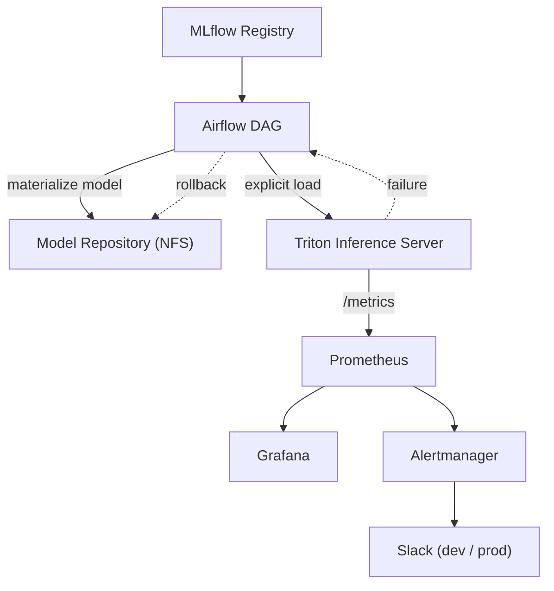
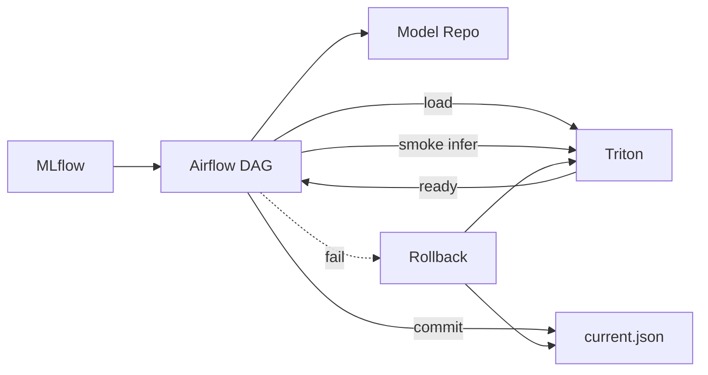

# 🚀 Triton Serving Platform – GitOps · Explicit Control · Alerting

> “Operate model serving as a 'validated state transition', not a 'deployment event'.”

This directory contains an implementation that configures **Triton Inference Server as a GitOps-based production serving platform**.

Models are **not auto-loaded**; they are applied to production via **explicit load** only after passing the verification chain.

---

## 🎯 What this Triton setup proves

- Keep Triton as an **always-on Serving Plane**
- Control model changes only via **explicit load/unload without redeploys**
- Single deployment chain: **MLflow → Airflow → Triton**
- Strict dev/prod separation (namespaces / storage / rules / alerts)
- Operational alerts based on **model execution metrics (latency / errors)**

---

## 🧩 Architecture Overview



---

## ⚙️ Core Design Principles

### 1. Explicit Model Control

- `model-control-mode=explicit`
- Model directories do not trigger **automatic loading ❌**
- Conditions for applying to production:
  1. materialize succeeded
  2. load succeeded
  3. readiness confirmed
  4. smoke inference passed
  5. `current.json` committed

---

### 2. Single Source of Truth

- `current.json` = **single source of truth for the active model**
- Keep failed models instead of deleting:
  - isolate under `.failed_<version>`
  - enables reproduction and root-cause analysis

---

### 3. GitOps First

-- Triton itself is managed via GitOps and remains **always running**
- Model changes are performed by the **Control Plane (Airflow)**, not GitOps
- Separate responsibilities: deployment vs serving

---

## 📂 Repository Structure (Triton)

```bash
charts/triton/
├── Chart.yaml
├── templates/
│   ├── deployment.yaml# Triton Deployment (explicit mode)
│   ├── service.yaml# ClusterIP
│   └── serviceMonitor.yaml# Prometheus scrape
└── values/
    ├── base.yaml# common settings
    ├── dev.yaml# dev resources / options
    └── prod.yaml# prod resources / options

```

```bash
apps/
├── triton-dev.yaml# ArgoCD Application (dev)
└── triton-prod.yaml# ArgoCD Application (prod)

```

```bash
ops/storage/triton/
├── dev/
│   ├── pv-pvc.yaml# Triton model-repo
│   └── pv-pvc-airflow.yaml# Airflow → Triton shared storage
└── prod/
    ├── pv-pvc.yaml
    └── pv-pvc-airflow.yaml

```

---

## 🔁 Operational Flow (Model Lifecycle)



---

## 📊 Observability & Alerting

### Metrics (Prometheus)

- `nv_inference_count`
- `nv_inference_request_success`
- `nv_inference_request_failure`
- `nv_inference_request_duration_us`

> The default Triton latency metric is not a histogram.


**Use mean-latency-based operational alerts instead of p95.**
> 

---

### Alerts (PrometheusRule)

- **High Mean Latency**
- **High Error Rate**
 - Strict separation by dev/prod namespaces
 - Alertmanager uses **null default** plus regex routing

---

### Dashboards (Grafana)

- RPS (success / failure)
- Mean latency (ms)
- Queue delay
- Pending requests
- Pod health

> Designed with a goal of responding within 30 seconds after an alert
> 

---

## 🧠 Operational Rules (TL;DR)

| Category | Rule |
| --- | --- |
| Load Control | explicit only |
| Rollback | DAG-based, no redeploys |
| Storage | dev/prod path separation |
| Metrics | model-execution focused |
| Alerts | namespace regex routing |
| GitOps | infra-only, models excluded |

---

## 🌱 Future Expansion

- GPU-based Triton (TensorRT / ONNX Runtime)
 - GPU-based Triton (TensorRT / ONNX Runtime)
 - Gateway layer (Nginx/Envoy) + separate HTTP error alerts
- Canary / Shadow traffic
- Triton gRPC-based serving
- ScyllaDB-based low-latency feature serving
